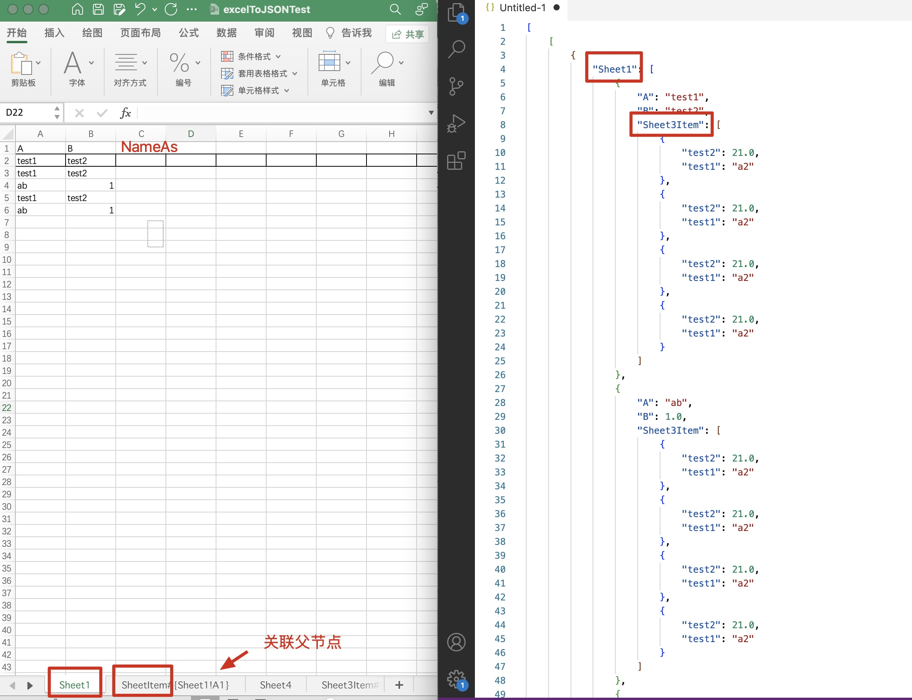

## 使用说明
为快速构建json 结构体，使用excel 可以快速构建想要的数据，故弄个程序快速转换  
{} 代表一个对象  
使用AsName{ToSheetName!Row} 封装子对象，可以添加每一个对象，也可以添加到某一行的子对象

使用标签关联数据
- ToSheetName 存在必填 关联是那一个sheet页下的子项，即每一行都关联子项
- Row 选填 关联是某一行的子项，数字
- AsName 选填，别名 默认_item


| test1 | test2                      |
|------------------------|----------------------------|
| a2                     | 21                         |
|                        |                            |
|                        |                            |
| Sheet1                 | Sheet2{Sheet!A1} |

**导出为**
```json
[
  {
    "root": [
      {
        "Sheet4#": [
          {
            "4.0": "a2",
            "5.0": 21.0
          },
          {
            "4.0": "a2",
            "5.0": 21.0
          },
          {
            "4.0": "a2",
            "5.0": 21.0
          },
          {
            "4.0": "a2",
            "5.0": 21.0
          }
        ],
        "s": "这里是提示信息",
        "Sheet1#": [
          {
            "Sheet2A": 1.0,
            "Sheet2B": "A",
            "Sheet3Item#": [
              {
                "test2": 21.0,
                "test1": "a2"
              },
              {
                "test2": 21.0,
                "test1": "a2"
              },
              {
                "test2": 21.0,
                "test1": "a2"
              },
              {
                "test2": 21.0,
                "test1": "a2"
              }
            ],
            "SheetItem": [
              {
                "item2": 21.0,
                "item1": "a2"
              },
              {
                "item2": 21.0,
                "item1": "a2"
              },
              {
                "item2": 21.0,
                "item1": "a2"
              },
              {
                "item2": 21.0,
                "item1": "a2"
              }
            ]
          },
          {
            "Sheet2A": 2.0,
            "Sheet2B": "B",
            "Sheet3Item#": [
              {
                "test2": 21.0,
                "test1": "a2"
              },
              {
                "test2": 21.0,
                "test1": "a2"
              },
              {
                "test2": 21.0,
                "test1": "a2"
              },
              {
                "test2": 21.0,
                "test1": "a2"
              }
            ],
            "SheetItem": [
              {
                "item2": 21.0,
                "item1": "a2"
              },
              {
                "item2": 21.0,
                "item1": "a2"
              },
              {
                "item2": 21.0,
                "item1": "a2"
              },
              {
                "item2": 21.0,
                "item1": "a2"
              }
            ]
          },
          {
            "Sheet2A": 3.0,
            "Sheet2B": "A",
            "Sheet3Item#": [
              {
                "test2": 21.0,
                "test1": "a2"
              },
              {
                "test2": 21.0,
                "test1": "a2"
              },
              {
                "test2": 21.0,
                "test1": "a2"
              },
              {
                "test2": 21.0,
                "test1": "a2"
              }
            ]
          },
          {
            "Sheet2A": 4.0,
            "Sheet2B": "B",
            "Sheet3Item#": [
              {
                "test2": 21.0,
                "test1": "a2"
              },
              {
                "test2": 21.0,
                "test1": "a2"
              },
              {
                "test2": 21.0,
                "test1": "a2"
              },
              {
                "test2": 21.0,
                "test1": "a2"
              }
            ]
          }
        ],
        "_item": [
          {
            "item2": 21.0,
            "item1": "a2"
          },
          {
            "item2": 21.0,
            "item1": "a2"
          },
          {
            "item2": 21.0,
            "item1": "a2"
          },
          {
            "item2": 21.0,
            "item1": "a2"
          }
        ]
      }
    ]
  },
  {
    "root2": [
      {
        "item2": 21.0,
        "item1": "a2"
      },
      {
        "item2": 21.0,
        "item1": "a2"
      },
      {
        "item2": 21.0,
        "item1": "a2"
      },
      {
        "item2": 21.0,
        "item1": "a2"
      }
    ]
  }
]
```